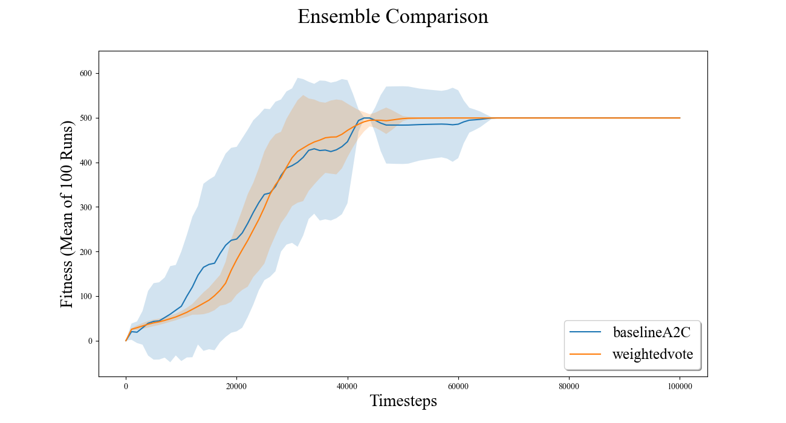
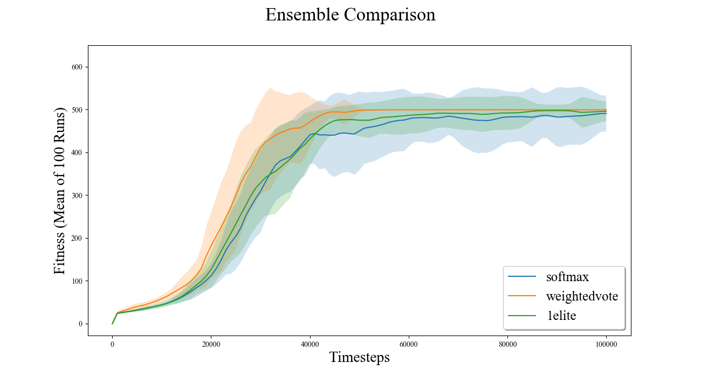
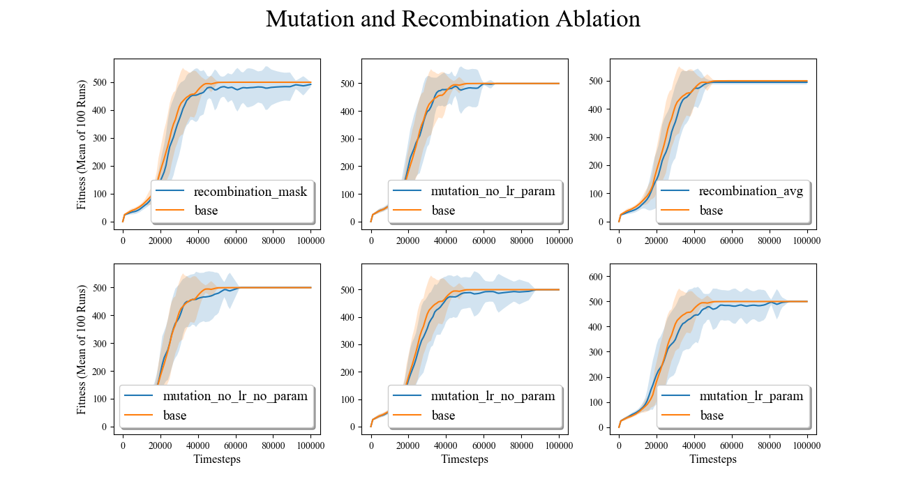

# EARL: Toward Stable Reinforcement Learning through Evolutionary Algorithms

## Abstract

Deep reinforcement learning (RL) has experienced tremendous growth in the past few years. However, training stability of agents continues to be an open research question. Here, the authors present a closely entwined hybrid method which combines concepts from the fields of evolutionary computing (EC) and deep RL as a means of mitigating training instability in RL agents. We are able to show that our method trains more consistently than RL and EC baselines alone. We also show that by employing ensemble methods, performance of RL agents can be improved during test time while simultaneously preserving the training stability of the agent. Finally, we conduct an ablation study to identify components within the EARL agent responsible for highest contribution. Though this work is in its early phases, it stands to benefit the stability of RL agents during training by combining multiple AI disciplines.

## Results

The graphs which correspond to the results of this work are documented below.

As shown, though the A2C algorithm is able to solve the environment faster on average, the EARL agent
is able to solve the environment with a tighter standard deviation than both the A2C and CGP baselines.

This demonstrates that the weight voting mechanism is able to out perform the 1-elite strategy. In
constrast, the softmax ensemble approach does not surpass the 1-elite strategy in final performance.

Here we see that the ablations of various mutation and recombination methods do not have significant
effect on the final performance or stability of agents during training. In particular, the mean
recombination strategy has high overlap with the unmodified base agent.

## Requirements

* Python 3.7
* Libraries
  * numpy
  * gym
  * matplotlib
  * scipy
  * torch

## Usage

### Analysis Scripts

* visualize_all.py [folder or file] [--f Enables scan of whole folder]
  * Example: "visualize_all.py results/experiment_1_baseline --f"
  * The primary visualization of the images shown above. Takes all the experiments in the folder and plots the STDs and means of the runs.

* visualize_runs.py [file]
  * Example: "visualize_runs.py results/experiment_1_baseline/baselineA2C.p"
  * Plots each individual run in an experiment.

* visualize_ablation [results/experiment_3_ablation]
  * Creates the ablation graphs. Only works on the ablation folder. 

* compare_stat_sig.py [folder] [--f, Required]
  * Example: "compare_stat_sig.py results/experiment_1_baseline --f"
  * runs a permutation of the all the experiments in the folder, comparing each using the defined statistical method. 

### Running Experiments
NOTE: At the moment, recombination requires lines to be un-commented in the grad_evo.py file. This will be fixed soon. 

* evo_ac_gym.py [config file]
  * Example: "evo_ac_gym.py configs/experiment_2_ensemble/evo_ac_cart_strat_weightedvote.json"
  * Runs the experiment with the specified config. An output pickle file will be created on completion. 

* hparam_search.py [config file]
  * Example: "hparam_search.py configs/experiment_2_ensemble/evo_ac_cart_strat_weightedvote.json"
  * Runs random search on specified config. This requires significant configuration fo the hparam_search file so usage is not recommended. 

## Project Structure
* /configs
  * Contains all of the configuration and hyperparameter details. Organized by experiment. 
* /evo_ac
  * Primary program folder. 
* /graphics
  * Result images generated by the visualization scripts. 
* /logger
  * Custom logger which was hooked up to baselines to provide fair comparison. 
* /results
  * The result logs of the project. Organized by experiment.

## Program Structure

* grad_evo.py
  * Handles parameter evolution. Uses the parameters of the network and the calculated gradients. 

* logger.py
  * Performs logging operations.

* model.py
  * The primary torch model for execution and gradient calculation. 

* runner.py
  * Upholds the experiment, run, and execution loops. Coordinates data passing between different components. 

* storage.py
  * Holds all the experiences of the model until the end of all the episodes.